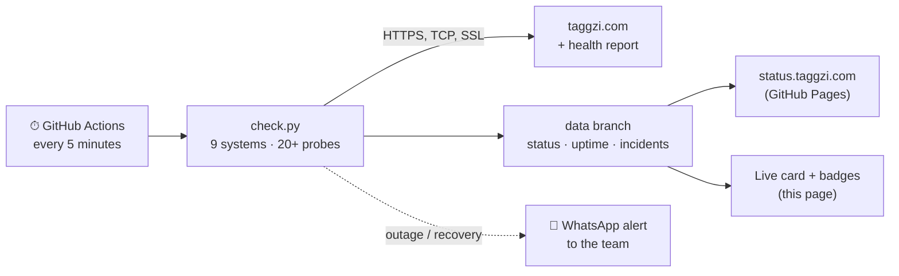

  

  
  
  

  <b><a href="https://status.taggzi.com">status.taggzi.com</a></b> · <a href="https://taggzi.com">taggzi.com</a> · <a href="https://taggzi.com/help/">Help centre</a> · <a href="mailto:support@taggzi.com">support@taggzi.com</a>

---

## Live status

  

This card and the badges above are regenerated every few minutes by the checker, so this page always shows the current state. The full page with 90-day history and incidents is at <a href="https://status.taggzi.com">status.taggzi.com</a>.

## What we monitor

| | System | What it means for you |
|---|---|---|
|  | **Tag scans** | Tapping or scanning a Taggzi tag opens the pet's profile |
|  | **Manual tag lookup** | Typing a tag's ID at taggzi.com/find-pet |
|  | **Private calling** | Finders can call owners from the pet page without sharing numbers |
|  | **Community alerts** | Lost-pet alerts reach people nearby |
|  | **App & login** | The Taggzi app and signing in |
|  | **Website** | taggzi.com, the shop and order pages |
|  | **Payments** | Ordering tags and Taggzi Pro |
|  | **Email & support** | Account emails, alerts and support replies |
|  | **Secure connection** | The padlock (SSL) certificates are valid and not about to expire |

## Is it just me?

If everything above is **operational**, Taggzi is working normally and the problem is most likely on your device or connection. Try refreshing, switching between Wi-Fi and mobile data, or updating the app. If you're still stuck, email **support@taggzi.com** and we'll help.

If something is **degraded** or has an **outage**, we already know about it and are working on it, so there's no need to report it.

## How it works

- **Independent:** it runs on GitHub, not on Taggzi's own hosting, so it keeps working if taggzi.com is down. If even the status.taggzi.com address won't load, use the backup at **[hi7dev.github.io/taggzi-status-backup](https://hi7dev.github.io/taggzi-status-backup/)**, which doesn't rely on taggzi.com's DNS.
- **Honest:** a single failed check shows as *degraded*. It counts as an *outage* only when it fails twice in a row, and only confirmed outages count against uptime.
- **Safe:** the checks use side-effect-free lookups, so they never log fake tag scans or notify pet owners.
- **Private:** no customer data is checked, stored or published here.

Taggzi · smart NFC & QR pet ID tags · UK-based · <a href="https://taggzi.com">taggzi.com</a>
